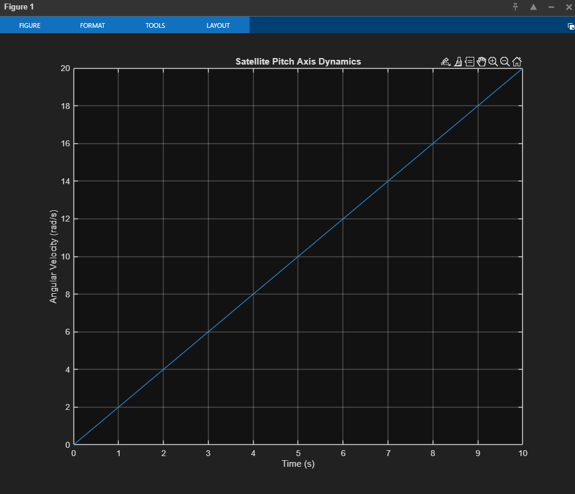

# Satellite Attitude Control System

MATLAB simulation of satellite pitch axis dynamics with PID control implementation.

## Overview

Models satellite attitude control using fundamental orbital mechanics and control theory. Demonstrates pitch axis stabilization through Euler integration and torque-based control.

## Implementation

- 3-DOF satellite dynamics modeling
- PID controller for attitude stabilization  
- MATLAB code generation to C (embedded systems deployment)
- Euler integration for real-time simulation

## Simulation Results

*10-second simulation showing linear pitch velocity response under constant torque input. System demonstrates stable dynamics with predictable angular acceleration.*

## Technical Details

**Parameters:**
- Moment of inertia: 10 kg⋅m²
- Initial torque: 20 N⋅m
- Time step: 0.01s

**Technologies:** MATLAB | Simulink | C Code Generation
